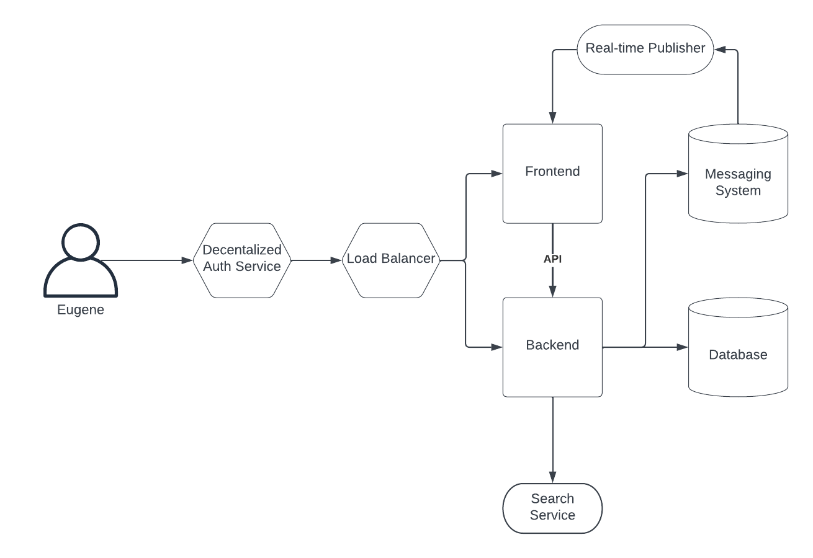

# Week 0 — Billing and Architecture

## Homework Technical Assignments

1. Watch all the videos. The most exciting part is about requirements, risks, architecture planning, and transferring business ideas to diagrams and code

2. [Logical diagram](https://lucid.app/lucidchart/cf0d1a93-728f-4460-801e-cd0a6fde62b5/edit?viewport_loc=333%2C151%2C1640%2C1112%2C0_0&invitationId=inv_332b7bec-dee8-4892-9213-b35ebd3bab9c)

3. [Napkin diagram](https://lucid.app/lucidchart/33ba2d57-551f-492d-9e3a-d253674c8ac9/edit?viewport_loc=-257%2C-505%2C1712%2C1161%2C0_0&invitationId=inv_6b1b98a0-455d-45fb-9cce-3463c65cd3ff)

4. Creating accounts for different services

5. Adding admin user, 2FA, setting the budget alarm, generating creds - this is the same 0-day activity if you ever took AWS courses previously

6. Enjoy the bootcamp

