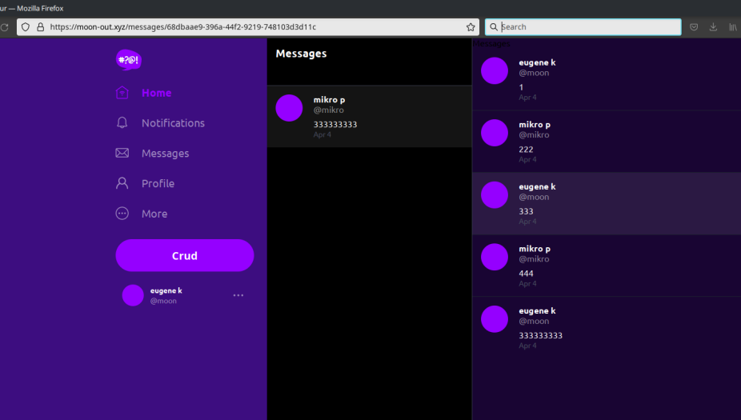
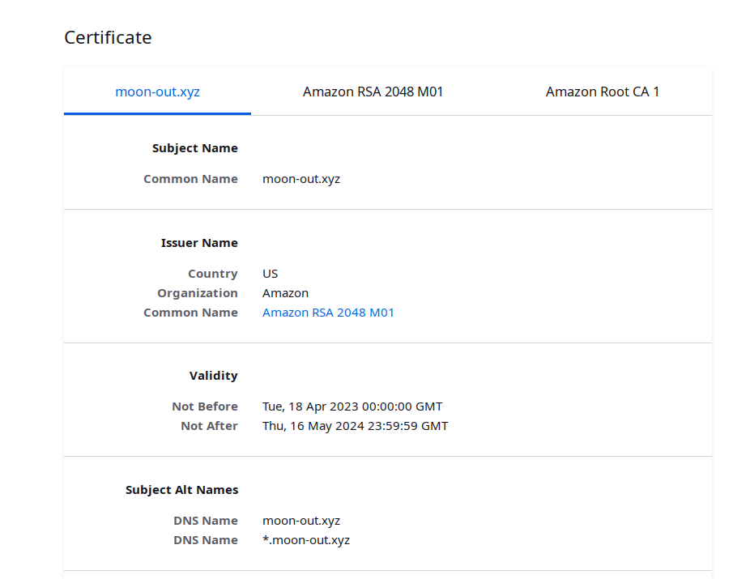

# Week 6 — Deploying Containers

## Containers

A container is an isolated environment that provides us an easy way to run an application with all its dependencies.

But what if we need to run multiple containers in an isolated environment but with the ability to communicate, scale, and write centralized logs? ~~Welcome to hell!~~ Meet the container orchestration services!


## Container orchestration services

There are tons of tools for orchestration. Most of them are open source, hard to learn, but with huge communities and miles of documentation. Kubernetes, Docker Swarm, Nomad, name it.

However, we use vendor-specific service because a developer has no goal, only a path. And all paths lead to AWS.

### AWS ECS

[Here](https://docs.aws.amazon.com/AmazonECS/latest/developerguide/Welcome.html) is everything you have to know about it.

AWS ECS provides several ways to run containers, be exact launch types - EC2 and Fargate.

#### Fargate

Fargate is a fully managed service. That means we have to specify the container description only. All the underlying infrastructure is controlled by AWS.

Pros:
- less effort to launch services
- no need to manage infrastructure

Cons:
- higher price than EC2
- less controlled environment
- certain limitations (lacking settings)

#### EC2

With EC2 launch type you have to control the compute layer. In brief, we run EC2 instance and specify containers running in it.


#### Essential parts of ECS

1. Clusters. ECS clusters are logical units of core services or tasks.
2. Task Definitions. Definition describes the container for service or task - container image, network settings, ports, health check, environment variables, etc.
3. Tasks. Actually, a running container created by Task Definitions.
4. Services. Groups of multiple same tasks or main task + some additional utility container like Xray.
5. Container agents. Used with EC2 to connect containers into clusters.

### ELB

A load balancer is required to provide access to services from outside of AWS.
[See](https://aws.amazon.com/elasticloadbalancing/?nc=sn&loc=1) full and fresh information about it.

There are three types of balancers:
1. Application Load Balancer. This is the type we are interested in. Just a http/s server to route requests from a browser to services
2. Gateway Load Balancer. Gateway Load Balancer helps you to deploy, scale, and manage your third-party virtual appliances. I have no idea about its use cases.
3. Network Load Balancer. Works on 4 OSI layer. It means that it can send TCP packets.
4. Classic Load Balancer. Old one. Do not use it for new projects.

#### Target groups

ALB sends requests based on the rules to different groups. In our case, everything that goes to a naked domain is redirected to the frontend group.
And requests to api.domain.com are forwarded to backend. Unfortunately ALB is rather primitive and cannot serve complex routing, e.g. we cannot redirect traffic from `api.domain.com/api/*`  to `api.domain.com/*`.


### Route53

[Route53](https://aws.amazon.com/documentation-overview/route53/) is DNS service. Since we have a domain name (https://moon-out.xyz in my case) we'd like to send all the traffic to this URL to our AWS services.

### AWS Certificate Manager

[This](https://aws.amazon.com/documentation-overview/cetificate-manager/) service allows us to create as sign ssl certificate for the domain.

## Homework

In general, it was not much harder than the previous one, but it included much more peaces of different information.

Cluster is up and running with frontend, backend, ALB, etc.

Domain is managed by Route53 - https://moon-out.xyz/

I had hard time understanding the difference between different roles.

Task role - describes the permission required to service performs actions - read data from S3, access DynanmoDb, etc.

Task execution role - gives permission to manage tasks - connect to ECR to get image, connect to Secret Manager to fetch environment variables, write logs.


Create service execution role and add permissions to assume roles.
```sh
aws iam create-role \
  --role-name CruddurServiceExecutionRole \
  --assume-role-policy-document file://aws/policy/service-assume-role-execution-policy.json
```

Assign required predefined permissions to service execution role
```sh
aws iam attach-role-policy \
  --policy-arn arn:aws:iam::aws:policy/service-role/AmazonECSTaskExecutionRolePolicy --role-name CruddurServiceExecutionRole
```

Assign required predefined permissions to service execution role
```sh
aws iam attach-role-policy \
  --policy-arn arn:aws:iam::aws:policy/service-role/AmazonECSTaskExecutionRolePolicy --role-name CruddurServiceExecutionRole
```

Assign permissions to read from Secret Manager to service execution role
```sh
aws iam put-role-policy \
  --policy-name CruddurServiceExecutionPolicy \
  --role-name CruddurServiceExecutionRole \
  --policy-document file://aws/policy/service-execution-policy.json
```

Create task role for task/service
```sh
aws iam create-role \
  --role-name CruddurTaskRole \
  --assume-role-policy-document file://aws/policy/task-assume-role-execution-policy.json
```

Assign permissions to communicate with Systems Manager service to task role
```sh
aws iam put-role-policy \
  --policy-name SSMAccessPolicy \
  --role-name CruddurTaskRole \
  --policy-document file://aws/policy/task-execution-policy.json
```

Add permissions to write XRay logs
```sh
aws iam attach-role-policy \
  --policy-arn arn:aws:iam::aws:policy/AWSXRayDaemonWriteAccess --role-name CruddurTaskRole
```

The rest is pretty common and straightforward.

### Generating env files from templates

Andrew wrote an Ruby script for this purpose. That was nice, but I prefer to use existing tools

*envsubst* standard cli utility allows to substitute envvars in a template file
```sh
envsubst < env_templates/backend-flask.env.template > backend-flask.env
```

And last, some screenshots of the site and signed certificate




